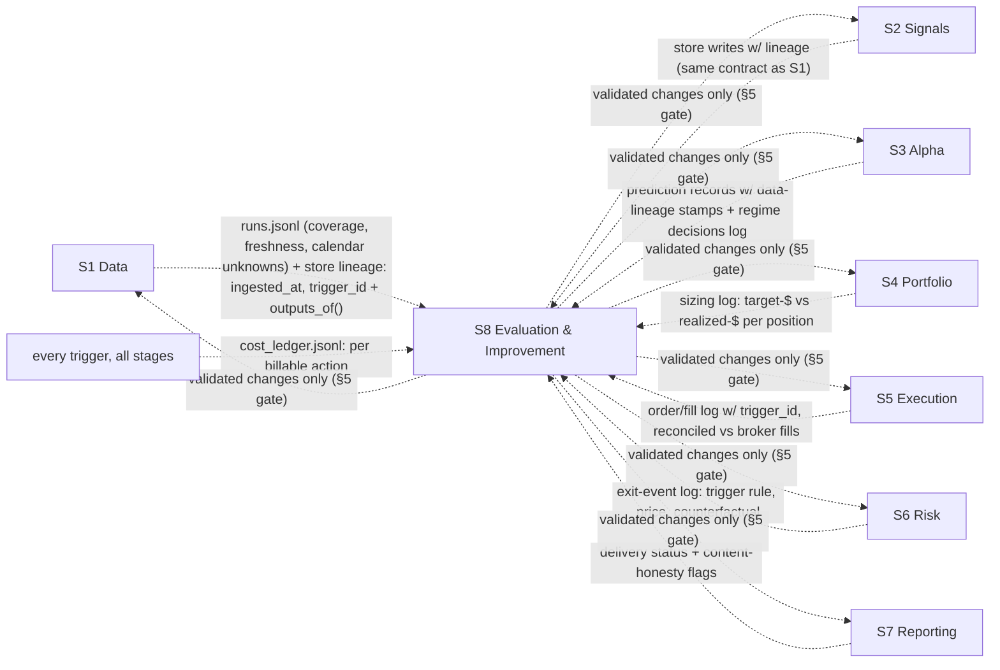

# System Design — stock-predictor

Status: **design baseline for the clean rebuild** (2026-07-24).
Predecessor: a working prototype (now archived off-repo) that traded real
capital and paid for every lesson encoded here. Where this doc states a rule,
there is a dated, real-money incident behind it.

**Sync rule: this document is the source of truth and changes in the same
commit as the behavior it describes.** A design doc that trails the code is
how the predecessor ended up with "non-negotiable" purge gaps that existed
only in documentation. Implementation-level decisions are recorded in the
*Implementation notes* blocks below as modules land.

---

## 1. Goal and honest constraints

- Long-only US-equity system, IBKR execution, small account (~$2K), daily cadence.
- **Aspirational** target: 10%/month. **Measured reality**: no alpha signal
  validated to date — the predecessor's technical-feature ranker showed
  Spearman IC ≈ 0 vs. market-excess returns on purged out-of-sample data,
  decile hit rates 48–54% (statistically flat), and two live days where its
  picks underperformed its own avoid-list. Therefore:
- **Prime directive: the system defaults to cash.** Live stock-picking is
  disabled until a signal passes the validation gate (§5). Execution, risk,
  and ops layers are built and kept live-ready in the meantime.
- Structural friction is real at this account size: ~$1/leg commission
  (0.2–0.6% one-way on typical positions) and whole-share granularity.
  Every design decision must survive those two numbers.

---

## 2. High-level architecture

```mermaid
flowchart TD
    subgraph DATA["S1 · Data Ingestion"]
        D1[Prices/volume OHLCV daily+intraday]
        D2[Macro: VIX, yields, DXY, Fed]
        D3[Earnings calendar]
        D4[Earnings-report signals - LLM grounded extraction]
    end

    subgraph SIG["S2 · Signal Generation"]
        F1[Technical features per ticker]
        F2[Cross-sectional ranks/z-scores]
        F3[Regime features - market level]
        F4[Fundamental signals: guidance, capex framing, adj-EPS surprise]
    end

    subgraph ALPHA["S3 · Alpha"]
        A1{"Regime gate: below threshold → CASH"}
        A2["Stock scorer — VALIDATION-GATED, currently disabled"]
        A3["Event-risk veto — earnings proximity, deterministic"]
    end

    subgraph PORT["S4 · Portfolio Construction"]
        P1[Confidence-tiered dollar targets]
        P2[Whole-share sizing + value-vs-target verification]
        P3[Concentration cap ≤25% per name]
    end

    subgraph EXEC["S5 · Execution"]
        E1[Position sync vs broker ground truth]
        E2[Limit orders only, RTH/AH offsets]
        E3[Fill verification loop]
        E4[Per-ticker cooldown after loss]
    end

    subgraph RISK["S6 · Intraday Risk Loop (15-min)"]
        R1[Hard stop -2%]
        R2[Time-stop: flat ±0.5% after 2h]
        R3[Soft-signal exits → LLM decision gate w/ web search]
        R4[Daily loss circuit breaker -2%]
        R5[EOD close-all]
    end

    subgraph REPORT["S7 · Reporting"]
        N1[Email on every fill]
        N2[Morning report: regime, ranks, earnings flags, honest calibration note]
        N3[Health checks + escalating alerts]
    end

    subgraph EVAL["S8 · Evaluation & Improvement"]
        V1[Nightly retrospective: root-cause → fix → backtest → gated deploy]
        V2[Prediction-quality tracking: daily IC vs full universe]
        V3[Rank calibration refresh - monthly]
    end

    DATA -->|"registered features: store writes w/ (event_time, ingested_at, trigger_id)"| SIG
    SIG -->|"derived features: tech.*, xsec.*, regime.* (same store contract)"| ALPHA
    A1 -- "regime OK" --> A2 --> A3
    A3 -->|"scored candidates + confidence tier + data-lineage stamp"| PORT
    A1 -- "regime weak" --> CASH[(Stay in cash)]
    PORT -->|"order specs: ticker, qty, limit, target-$ + realized-$ check"| EXEC
    EXEC -->|"verified fills w/ trigger_id"| RISK
    RISK -->|"exit events + P&L"| REPORT
```



**Validation gate overlay** (applies to S3-A2 and to every change S8 promotes):
no component reaches live capital until it passes §5 in the exact
configuration it will run in. "Validated in isolation" is not validated —
the predecessor's exit-cascade deployed on isolated validation and lost
money at every threshold when run in the real pipeline.

### The audit plane: every stage feeds S8, with a defined log contract

Data flow (above) and observability flow are drawn separately so each stays
readable — but the audit edges are just as binding as the data edges:



**Per-link log contract** — each row defines what must exist for S8 to check
and confirm that stage's behavior. A stage without its log artifact is not
done, regardless of whether its happy path works:

| Link | Required log artifact | What S8 checks with it | Status |
|---|---|---|---|
| S1 → S8 | `runs.jsonl` run record (status incl. crashes, coverage %, calendar unknowns) + store lineage (`ingested_at`, `trigger_id` on every value) + `outputs_of(trigger_id)` | Did ingestion run and complete? Is today's data actually fresh? What exactly did each run produce? | **Implemented** |
| S2 → S8 | Derived-feature store writes under the same bitemporal contract | Same lineage/freshness checks as S1, applied to derived features | **Implemented** |
| S3 → S8 | Prediction record per (date, ticker): score, tier, model version, **data-lineage stamp** (max `ingested_at` of inputs used) | Daily IC vs. realized excess returns; stale-input prediction rate (predictions on old data are pipeline defects, not model error) | **Implemented** for regime + event-risk records (lineage-stamped); scorer records n/a until a scorer passes §5 |
| S4 → S8 | Sizing log per order: target-$, realized-$, deviation %, skip reasons | Allocation-deviation distribution; weight-order inversions; overshoot rejections | Specced |
| S5 → S8 | Order/fill log (`trigger_id` on every order) reconciled against broker fills — broker is ground truth, not in-memory state | Fill rate, slippage, rejections, reconciliation mismatches (target: zero) | Specced |
| S6 → S8 | Exit-event log: which rule fired, at what price, plus counterfactual (e.g. hold-to-EOD P&L) | Stop adherence; time-stop yield vs. counterfactual; gate accuracy | Specced |
| S7 → S8 | Delivery log + flags for any displayed metric lacking its honesty context | Delivery success; report-honesty regressions | Specced |
| all → S8 | `cost_ledger.jsonl`: one record per billable action with `trigger_id` | Cost per trigger type/day; >2× trailing-median regressions | **Implemented** |
| S8 → any | Promotion record: change, validation evidence (§5), deploy confirmation | Realized-vs-backtest gap per deployed change; fix survival rate | Specced |

---

## 3. Per-step specification

### S1 · Data Ingestion

| | |
|---|---|
| **Input** | Ticker universe (~140–150 names, price ≥ $25); yfinance OHLCV (daily + 5-min); macro series (VIX, 10Y, curve, DXY, Fed rate, FOMC calendar); earnings calendar (yfinance `earnings_dates`, requires `lxml` — silently degrades without it); grounded LLM extraction of the most recent earnings report per ticker (Claude API + real web search) |
| **Output** | (1) Immutable raw source data (OHLCV bars, macro series, raw LLM responses) retained for reproducibility; (2) **features registered in the feature store** (contract below) — everything downstream-consumable is a store feature, no bespoke side-channel artifacts. Namespaced registry, e.g. `price.*` (**`price.current`** = live session-aware quote {price, session: pre/regular/post/closed} — THE price for display/sizing/decisions; plus `price.close`, `price.volume` for history/indicators), `macro.*` (vix, yield10y, curve, …), `calendar.days_to_earnings`, `fundamental.*` (earnings_signal {guidance/capex/surprise}; **shares_outstanding**; **statements** {revenue, net_income, equity, assets, debt, cash, capex, FCF, ...} stamped at PUBLICATION date; **analyst_snapshot** {forward_eps, n_analysts, recommendation_mean, target} snapshotted daily to accrue a revision series) |
| **Metrics** | Data freshness (hours since last bar; alert > 24h on a trading day) · Coverage (tickers with today's data / universe; alert < 95%) · Registry conformance: % of downstream reads served from registered features (target 100%; any bespoke-artifact read is a defect) · Earnings-signal grounding rate (% of calls returning `has_recent_report` with cited evidence vs. errors) · LLM call budget (calls/day; cap and monitor — a duplicated compute path once silently doubled daily spend) |
| **Hard rules** | LLM extraction must be **grounded** (real search results) — an ungrounded classifier flip-flopped HIGH/LOW on a stable non-event and caused real whipsaw trades. Fails closed (`insufficient_data`), never guesses. **Current price is always the live, session-aware quote** (`price.current`, picked by `marketState` from pre/regular/post fields) — never `price.close` (the prior bar). `fast_info.lastPrice` does NOT carry extended-hours data and returns a stale close (INTC $100.23-vs-$103 bug); use `.info` pre/postMarketPrice. This is wired into ingestion, not just defined. |

#### Feature store contract (consumed by S2–S8)

- **Registry**: every feature is declared before first write — name (namespaced),
  dtype, scope (per-ticker / market-level), source stage, update cadence, and
  its **point-in-time rule** (when the value becomes knowable). Unregistered
  writes are rejected.
- **Bitemporal keys**: values are stored keyed by *(feature, scope, event_time,
  ingested_at)*. `event_time` is what backtests join on (no lookahead by
  construction); `ingested_at` is what S8's lineage audit checks (a prediction
  reading values whose `ingested_at` predates the session is a stale-input
  defect). This makes the predecessor's undetected 22-cycle placeholder-value
  failure structurally impossible to miss.
- **Append-only, versioned**: corrections append a new `ingested_at` version;
  history is never rewritten, so any past prediction can be reproduced exactly
  from what was known at the time.
- **One read API for research and production**: backtests and the live trader
  read features through the same interface. No manifest-maintained feature
  lists, no separate research/production code paths — the train/serve skew
  that let the predecessor validate components in configurations that never
  matched live.

**Implementation notes (landed 2026-07-24)**
- `src/core.py` (feature-store half): SQLite at `runtime/features.db` (stdlib,
  single file, zero infra — the contract is the point, the backend is
  deliberately boring). `register()` is idempotent but raises on spec change:
  semantic changes get a NEW feature name, meaning is never mutated under an
  old one. Reads: `read_asof(feature, scope, event_time, as_known_at)` and
  `read_panel(...)`; `as_known_at` filters on `ingested_at`, which is what
  makes backtests lookahead-impossible by construction. `freshness()` serves
  S8's staleness audit. Every write carries `trigger_id` (lineage → cost ledger).
  `outputs_of(trigger_id)` answers "we triggered the component — what was the
  output?" in one call: per-feature value counts + event-time ranges for
  everything that invocation wrote. Paired with its runs.jsonl record
  (status/metrics/cost), every trigger has complete observability: what ran,
  what it cost, what it produced.
- `src/core.py` (trigger half): `Trigger` context manager mints `trigger_id`,
  appends to `runtime/logs/cost_ledger.jsonl` (per billable action) and
  `runtime/logs/runs.jsonl` (per run — **including crashed runs**, logged with
  `status="error"`; silence must never be indistinguishable from success).
  Ledger prices are estimates for regression detection; the billing dashboard
  stays ground truth for absolute spend.
- `src/s1_data.py` (registry section): the declared S1 feature set (`price.close`,
  `price.volume`, `macro.vix`, `macro.yield10y`, `macro.spy_close`,
  `calendar.days_to_earnings`, `fundamental.earnings_signal`) with per-feature
  point-in-time rules. This file IS the ingestion contract — the store rejects
  anything not declared here.
- Fundamentals for S2 (added 2026-07-24, so the value/quality feature block
  has raw data to derive from): `fundamental.shares_outstanding` (daily
  snapshot — was entirely missing, blocks even market cap), `fundamental.
  statements` (quarterly income/balance/cashflow line items), and
  `fundamental.analyst_snapshot` (daily consensus, to build a revision series
  going forward — yfinance cannot backfill revisions). **Publication-date
  discipline** is the make-or-break: statements are stored at `event_time` =
  the real earnings ANNOUNCEMENT date (from `earnings_dates`), falling back to
  `period_end + REPORTING_LAG_DAYS` (60d). A test proves a backtest standing
  between quarter-end and filing date does NOT see the statement — no
  fundamentals lookahead. Confirmed on real data: INTC's Q2 stored at
  2026-07-23 (its true announcement), not the 2026-06-30 period end.
- `price.current`: session-aware live quote wired into the ingestion loop
  (not merely defined — it was defined-but-unwired once, reproducing the
  stale-close bug). Metrics report `current_prices_ok` and a per-session
  breakdown; the S1 example prints current-vs-close side by side.
- `src/s1_data.py` (fetchers section): the only network I/O in the data layer (plus the LLM
  call in the earnings-extraction section); everything else takes fetchers as injected
  callables so tests run offline. Unknown values return `None`, never sentinel
  numbers (the predecessor's `days_to_earnings=999` sentinel leaked into
  model features as a plausible-looking number).
- Runtime artifacts live under gitignored `runtime/` (override:
  `STOCK_PREDICTOR_RUNTIME`).

### S2 · Signal Generation

| | |
|---|---|
| **Input** | Feature store reads (`price.*`, `macro.*`, `calendar.*`, `fundamental.*`) |
| **Output** | **Derived features written back to the feature store** under their own namespaces — `tech.*` (RSI, BB, ATR, momentum 3–60d, volume ratios), `xsec.*` (per-day cross-sectional ranks/z-scores), `regime.*` (market-level) — same registry, bitemporal keys, and point-in-time rules as S1 outputs. Model-ready matrices are assembled from store reads at query time, not maintained as separate artifacts |
| **Metrics** | Feature NaN rate per column (alert on regression) · Lookahead audit: every feature reproducible using only data available at its timestamp (tested, not asserted) · Feature-target leak check on any new feature before it enters a model |
| **Hard rules** | Raw next-day return targets conflate market drift with stock selection — in a trending window every decile of a useless ranker shows positive "returns." All cross-sectional evaluation uses **market-excess** (and where relevant sector-excess) returns. |

**Implementation notes (landed 2026-07-24)**
- `src/s2_signals.py`: registry · pure computation functions · orchestrator.
  Technical block: `tech.rsi14/mom5/mom20/hvol20/vr20`. **Fundamental block
  (added 2026-07-24, the enrichment that was the whole point of S1's
  fundamentals): value** (`fund.book_to_price`, `fund.earnings_yield`,
  `fund.fcf_yield`), **quality** (`fund.roe`, `fund.gross_profitability`,
  `fund.net_margin`), **size** (`fund.market_cap`), each derived from S1's
  statements/shares/analyst read publication-date-aware (a statement filed
  after event_date is invisible — tested). Cross-sectional ranks of the
  factors (`xsec.rank_earnings_yield/fcf_yield/roe/gross_profitability`) are
  the selection-relevant form. Real run: 22 technical-only features → 55
  total, 33 fundamental; INTC ROE -12.6% (its GAAP CHIPS-writedown loss). All input reads go through `core.py`'s `read_series(...,
  end_event_time=event_date)`, so lookahead is impossible by construction —
  and the property is TESTED: appending future bars must not change a past
  day's computed signals (`test_future_data_cannot_change_past_computation`).
- A ticker with no bar ON the event date is skipped and counted
  (`no_bar_on_date`) — never computed from an old bar and presented as fresh
  (that is the 22-cycle placeholder failure in per-ticker form).
- Insufficient history skips that feature only, counted per feature in run
  metrics. No sentinels.
- `core.py` gained `read_series()` (bitemporal history reads: corrections
  shadow, `as_known_at` filters) — tested for both properties.

### S3 · Alpha

| | |
|---|---|
| **Input** | S2 feature matrix |
| **Output** | Market regime score → CASH / trade decision; per-ticker score + confidence tier (HIGH/MID/LOW/NO_TRADE); event-risk level (LOW/MED/HIGH). **Every output record carries a data-lineage stamp** (timestamp of the S1 snapshot it was computed from) so S8 can distinguish model error from stale-input error |
| **Metrics** | **Regime gate**: % of gated (cash) days where universe median return was negative (gate precision); opportunity cost of gated days · **Scorer (the gate to go live, per §5)**: Spearman IC vs. excess returns on purged OOS ≥ 0.03 sustained; top-vs-bottom decile spread > 0 with p < 0.05 on **non-overlapping** windows; hit rate vs. 50% null · **Event veto**: % of vetoed names with realized |move| > 2× universe median on event day |
| **Hard rules** | Scorer is **disabled for live sizing** until §5 passes — currently informational-only in reports, labeled with its measured (lack of) skill. Deterministic facts (days-to-earnings) and LLM classifications must agree before either triggers real-money action alone. |

**Implementation notes (landed 2026-07-24)**
- `src/s3_alpha.py`: A1 regime gate is a transparent rule-based v1 — breadth
  (.4) + VIX (.3) + SPY-vs-20d-trend (.3), threshold 0.6 — NOT the
  predecessor's pickled 5-model ensemble (unreviewable binaries, excluded by
  policy). Unvalidated per §5, therefore informational-only; on missing
  inputs it fails TOWARD CASH naming the gap (first real trigger did exactly
  this and exposed that S1's macro fetch had no history — fixed to 90d).
- A2 `score_stocks()` returns an explicit DISABLED status with the measured
  reason; enabling requires a §5 pass and a doc status change in the same commit.
- A3 event risk is deterministic from `calendar.days_to_earnings`; missing
  calendar → **UNKNOWN**, never silently LOW (the predecessor's 999 sentinel
  effectively claimed "no event near" on no evidence).
- Every decision record carries `inputs_max_ingested_at` — the data-lineage
  stamp S8's stale-input audit reads.
- Real-trigger confirmed: regime CASH @ 0.386 on 2026-07-24 (breadth 0.2),
  directionally matching the predecessor ensemble's live call (0.163, CASH).

### S4 · Portfolio Construction

| | |
|---|---|
| **Input** | S3 confidence tiers + approved candidates; account net-liq; current positions |
| **Output** | Per-name dollar target → whole-share order spec `{ticker, qty, limit_price}` |
| **Metrics** | **Allocation deviation**: `|realized_$ − target_$| / target_$` per position, logged every sizing pass; reject if overshoot > 35% · Concentration: max single-name % (cap 25%) · Total deployed vs. budget (a whole-share floor once turned a $2,000 budget into $2,232 deployed, with the two lowest-conviction names as the largest positions) · Fee drag: commissions / gross P&L per day |
| **Hard rules** | **Dollar value is the unit of account; share count is a derived quantity.** Verify realized value against the per-position target after every sizing pass — the account-level cap alone cannot catch per-position inversion (hit twice: 2026-07-22, 2026-07-24). Undershoot (round-down) is acceptable; overshoot is not. |

### S5 · Execution

| | |
|---|---|
| **Input** | S4 order specs; IBKR Gateway session |
| **Output** | Verified fills; updated position state; trade log |
| **Metrics** | Fill rate within limit window · Slippage vs. limit price · Reconciliation mismatches between internal state and `ib.positions()` (target: zero; alert on any) · Order rejection count · API client-session count (Gateway degrades under many concurrent sessions — observed full connection wedge) |
| **Hard rules** | Limit orders only (0.3% offset RTH / 0.5% AH). Position sync against broker ground truth before every order. Fill status verified by polling, never assumed from submission. Per-ticker cooldown after any losing exit — no same-session re-entry. Internal JSON logs do not survive restarts; IBKR fills are the only cross-restart truth. |

### S6 · Intraday Risk Loop (15-min cycle)

| | |
|---|---|
| **Input** | Open positions, live prices, news/event signals |
| **Output** | Exit orders; circuit-breaker halt |
| **Metrics** | Stop adherence: realized loss at exit vs. −2% trigger (gap = slippage + cycle latency) · Time-stop yield: P&L of D7 exits vs. counterfactual hold-to-EOD (validated +$5.76 net on 30 real entries; keep measuring live) · Decision-gate accuracy vs. known outcomes (predecessor best: 83%) and veto rate · Circuit-breaker activations |
| **Hard rules** | Hard stop (−2%) is deterministic and **never** routed through the LLM gate. Soft-signal exits (sentiment/event) always are. Exit models with negative validation results stay disabled — a live-money bug gets a defensive disable, not a live patch under pressure. |

### S7 · Reporting

| | |
|---|---|
| **Input** | Fills, positions, daily analysis outputs |
| **Output** | Fill emails (HTML, verified status); morning report (regime, ranked list **with honest calibration note**, earnings flags with mismatch warnings); health alerts (escalating for critical, deduped for non-critical) |
| **Metrics** | Delivery success rate · Alert latency for critical failures · **Honesty check**: any displayed "prediction" must carry its measured historical hit rate and sample size — a near-coin-flip signal displayed as a confident price target is a defect (shipped once; removed) |
| **Hard rules** | Reports run every trading day regardless of regime — cost gating must never silently drop decision-relevant information (an earnings beat by a top-ranked name was once invisible because the check was skipped on a no-trade day). |

### S8 · Evaluation & Continuous Improvement

| | |
|---|---|
| **Input** | Trade logs, IBKR fills (ground truth), full-universe prediction records **with per-prediction data-lineage stamps**, S1 ingestion logs (fetch timestamps, coverage), S4 sizing logs (target vs. realized dollars), S5 execution logs (orders, fills, rejections), missed-opportunity scans |
| **Output** | Nightly retrospective (root cause → ≤1 fix proposal → backtest → gated deploy or DEFER); **nightly cross-stage audit report** (data-freshness lineage, sizing fidelity, execution quality — see below); refreshed rank calibration (monthly); prediction-quality time series |
| **Metrics** | **Daily IC**: Spearman(prediction, realized excess return) across the full universe — not just held names · Realized-vs-backtest gap per deployed change · Fix survival rate (proposed → validated → still-positive after 30 live days) · **Stale-input prediction rate**: % of the day's predictions whose lineage stamp shows input data older than the trading session (target 0; every stale prediction excluded from IC scoring and flagged) · **Sizing fidelity aggregate**: distribution of S4 allocation deviation across the day's orders (flag any position that breached tolerance or inverted the intended weight ordering) · **Execution quality aggregate**: fill rate, slippage vs. limit, rejections, reconciliation mismatches — from logs vs. IBKR fills, not from in-memory state · **Cost-per-trigger regressions** from the cost ledger (see cross-cutting metric): flag any trigger type > 2× its trailing-median cost |
| **Hard rules** | **Every prediction record must stamp the timestamp of the data snapshot it used — no lineage, no evaluation** (predictions made on placeholder/stale inputs are a data-pipeline defect, not model error, and must be attributed as such; the predecessor ran 22 consecutive regime cycles on a pre-market placeholder value with nothing detecting it). The nightly audit closes the loop on S1/S4/S5, not just S3 — a correct prediction sized wrongly or filled badly is still a system failure and must land in the retrospective with the right stage attribution. A fix with no historical data to test against isn't general enough — reformulate into a mechanically testable rule, up to 3 iterations; if none beat baseline, **DEFER is a valid outcome**. Never re-validate a fix on the same trades used to derive it. Same-day anecdote replay is not a backtest. |

---

### Cross-cutting metric (all stages): cost per trigger

Every pipeline invocation starts from a **trigger** — a cron entry firing, a
15-min review cycle, a morning-report run, a nightly retrospective, a manual
invocation. The metric is the **fully-loaded cost attributed to that trigger**,
counting every billable action it transitively initiates:

- **Trace ID propagation**: each trigger mints a `trigger_id`; every spawned
  action (LLM API call, web search, data fetch, broker order) carries it. If
  one trigger initiates two LLM calls inside earnings extraction, both calls'
  token costs land on that trigger — no orphan spend.
- **Cost ledger**: one append-only record per billable action:
  `{trigger_id, trigger_type, stage, provider, tokens_in, tokens_out,
  web_searches, unit_cost, commission, timestamp}`. Broker commissions
  attribute to the execution trigger that placed the order, so fee drag and
  API spend are readable in the same ledger.
- **Reported metrics**: cost per trigger instance · cost per trigger *type*
  per day (the actionable series) · cost per stage per day · day-over-day
  regression alert when a trigger type's cost jumps > 2× its trailing median.

Why this is a first-class metric and not an afterthought — all three of these
burned real money in the predecessor and were only found by manually reading a
billing dashboard after the fact:

1. A morning-report script ran its full compute twice per trigger (compute
   pass + render pass), silently doubling ~25 grounded LLM calls to ~50 every
   day. Cost-per-trigger would have shown the report trigger at 2× its
   expected cost from day one.
2. A health check invoked a full LLM CLI call every 15 minutes — 52 calls/day
   from a trigger whose job was a boolean auth probe.
3. A cost-*saving* gate then over-corrected and silently skipped
   decision-relevant earnings checks on no-trade days. Per-trigger cost
   visibility is what allows cutting real waste **without** blind gating that
   drops information — you cut the duplicated calls, not the informative ones.

S8's nightly audit consumes this ledger: cost-per-trigger-type regressions are
surfaced next to prediction quality and execution quality, and any proposed
"optimization" must show which trigger's cost it reduces and prove it drops no
decision-relevant output.

---

## 4. Repository layout (target)

```
stock-predictor/
├── docs/DESIGN.md            # this file
├── src/                      # flat by design — project style: as few files
│   ├── core.py               #   as possible; simple, working. One file for
│   ├── s1_data.py            #   cross-cutting infra (trigger+store), one
│   ├── s2_signals.py         #   file per stage as each stage lands.
│   ├── s5_execution.py       #   (s2+ are future; only core+s1 exist today)
│   └── ...
├── tests/                    # tests may be separate files (test_core, test_s1_data, ...)
├── examples/                 # per stage: a runnable script that runs the
│                             #   stage on REAL market data and SAVES the
│                             #   actual input + output as committed .json
│                             #   snapshots (sX.input.json / sX.output.json)
│                             #   — real data you can read without running.
│                             #   (Deterministic exact-value checks live in
│                             #   tests/, which use synthetic inputs.)
└── ops/                      # cron entries, runbooks
```

Never in git: credentials, account identifiers, market data, trade history,
model binaries (see `.gitignore`).

---

## 5. Validation protocol (the gate to live capital)

1. **Split by time** with real gaps implemented in code: train → **15-day
   purge** → validate → **7-day embargo** → test. (The predecessor *declared*
   these gaps in a manifest but never applied them to any date boundary.)
2. **Test window is touched once.** Hyperparameters and thresholds are chosen
   on validate only.
3. **Excess returns, not raw returns**, for all cross-sectional claims.
4. **Non-overlapping windows for significance.** Overlapping multi-day
   forward returns inflated an apparent p < 0.001 result to p ≈ 0.3 when
   corrected — that check is mandatory, not optional.
5. **Null baselines always reported**: predict-zero MSE, 50% hit rate,
   universe-average return. A model that doesn't beat the null doesn't ship.
6. **Multi-seed robustness** (≥5 seeds/perturbations, all positive) before
   any promotion.
7. **Staged go-live**: paper (dry-run, ≥5 sessions) → live with minimum size →
   full size. Any restart/config change requires explicit confirmation the
   new code is what's running.

## 6. Current status & migration order

| Layer | Status |
|---|---|
| Feature store + trigger/cost logging | **Migrated 2026-07-24** — `src/core.py`; 11 passing contract tests; smoke-tested on live data |
| Alpha (S3) | **Migrated 2026-07-24** — `src/s3_alpha.py`; rule-based regime gate (informational, fails toward cash), deterministic event risk, scorer explicitly DISABLED pending §5 |
| Signal generation (S2) | **Migrated + enriched 2026-07-24** — `src/s2_signals.py`; technical + fundamental (value/quality/size) blocks; publication-date-aware; PIT tested; 55 features/3 tickers real-confirmed |
| Data + earnings signals (S1) | **Migrated 2026-07-24** — `src/s1_data.py` (prices, macro, calendar, grounded earnings extraction with per-call cost attribution); earnings extraction is observation-only |
| Execution/safety (S4–S6 core) | **Next to migrate** — proven in production, needs modularization + unit tests |
| Ops/reporting (S7) | Migrate after execution, with cost fixes retained |
| Alpha scorer (S3-A2) | **Not migrated as-is** — measured no-edge; rebuild around fundamentals/earnings features and pass §5 first |
| Regime gate (S3-A1) | Migrate with S3 scaffolding; it demonstrated correct cash calls live |
| Automated trading cron | **Off** until cutover criteria: all above migrated + tested + §5 pass for any live signal |
