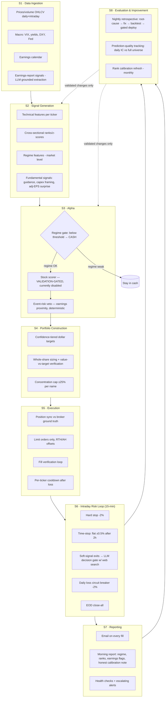

# System Design — stock-predictor

Status: **design baseline for the clean rebuild** (2026-07-24).
Predecessor: a working prototype (now archived off-repo) that traded real
capital and paid for every lesson encoded here. Where this doc states a rule,
there is a dated, real-money incident behind it.

---

## 1. Goal and honest constraints

- Long-only US-equity system, IBKR execution, small account (~$2K), daily cadence.
- **Aspirational** target: 10%/month. **Measured reality**: no alpha signal
  validated to date — the predecessor's technical-feature ranker showed
  Spearman IC ≈ 0 vs. market-excess returns on purged out-of-sample data,
  decile hit rates 48–54% (statistically flat), and two live days where its
  picks underperformed its own avoid-list. Therefore:
- **Prime directive: the system defaults to cash.** Live stock-picking is
  disabled until a signal passes the validation gate (§5). Execution, risk,
  and ops layers are built and kept live-ready in the meantime.
- Structural friction is real at this account size: ~$1/leg commission
  (0.2–0.6% one-way on typical positions) and whole-share granularity.
  Every design decision must survive those two numbers.

---

## 2. High-level architecture



**Validation gate overlay** (applies to every dashed edge and to S3-A2):
no component reaches live capital until it passes §5 in the exact
configuration it will run in. "Validated in isolation" is not validated —
the predecessor's exit-cascade deployed on isolated validation and lost
money at every threshold when run in the real pipeline.

---

## 3. Per-step specification

### S1 · Data Ingestion

| | |
|---|---|
| **Input** | Ticker universe (~140–150 names, price ≥ $25); yfinance OHLCV (daily + 5-min); macro series (VIX, 10Y, curve, DXY, Fed rate, FOMC calendar); earnings calendar (yfinance `earnings_dates`, requires `lxml` — silently degrades without it); grounded LLM extraction of the most recent earnings report per ticker (Claude API + real web search) |
| **Output** | Per-ticker feature frames (append-only store); `_macro` frame; per-ticker earnings-signal record: `{guidance_direction, capex_trend, capex_framing, adj_eps_surprise_pct, revenue_surprise_pct, one_time_items[], net_signal, confidence}` |
| **Metrics** | Data freshness (hours since last bar; alert > 24h on a trading day) · Coverage (tickers with today's data / universe; alert < 95%) · Earnings-signal grounding rate (% of calls returning `has_recent_report` with cited evidence vs. errors) · LLM call budget (calls/day; cap and monitor — a duplicated compute path once silently doubled daily spend) |
| **Hard rules** | LLM extraction must be **grounded** (real search results) — an ungrounded classifier flip-flopped HIGH/LOW on a stable non-event and caused real whipsaw trades. Fails closed (`insufficient_data`), never guesses. Extended-hours prices come from fields that actually carry them — `fast_info.lastPrice` does not (stale-close bug, caught live). |

### S2 · Signal Generation

| | |
|---|---|
| **Input** | S1 feature frames |
| **Output** | Point-in-time-correct feature matrix per (date, ticker): technical (RSI, BB, ATR, momentum 3–60d, volume ratios), cross-sectional per-day ranks/z-scores, market-level regime features, fundamental signals from S1-D4 |
| **Metrics** | Feature NaN rate per column (alert on regression) · Lookahead audit: every feature reproducible using only data available at its timestamp (tested, not asserted) · Feature-target leak check on any new feature before it enters a model |
| **Hard rules** | Raw next-day return targets conflate market drift with stock selection — in a trending window every decile of a useless ranker shows positive "returns." All cross-sectional evaluation uses **market-excess** (and where relevant sector-excess) returns. |

### S3 · Alpha

| | |
|---|---|
| **Input** | S2 feature matrix |
| **Output** | Market regime score → CASH / trade decision; per-ticker score + confidence tier (HIGH/MID/LOW/NO_TRADE); event-risk level (LOW/MED/HIGH) |
| **Metrics** | **Regime gate**: % of gated (cash) days where universe median return was negative (gate precision); opportunity cost of gated days · **Scorer (the gate to go live, per §5)**: Spearman IC vs. excess returns on purged OOS ≥ 0.03 sustained; top-vs-bottom decile spread > 0 with p < 0.05 on **non-overlapping** windows; hit rate vs. 50% null · **Event veto**: % of vetoed names with realized |move| > 2× universe median on event day |
| **Hard rules** | Scorer is **disabled for live sizing** until §5 passes — currently informational-only in reports, labeled with its measured (lack of) skill. Deterministic facts (days-to-earnings) and LLM classifications must agree before either triggers real-money action alone. |

### S4 · Portfolio Construction

| | |
|---|---|
| **Input** | S3 confidence tiers + approved candidates; account net-liq; current positions |
| **Output** | Per-name dollar target → whole-share order spec `{ticker, qty, limit_price}` |
| **Metrics** | **Allocation deviation**: `|realized_$ − target_$| / target_$` per position, logged every sizing pass; reject if overshoot > 35% · Concentration: max single-name % (cap 25%) · Total deployed vs. budget (a whole-share floor once turned a $2,000 budget into $2,232 deployed, with the two lowest-conviction names as the largest positions) · Fee drag: commissions / gross P&L per day |
| **Hard rules** | **Dollar value is the unit of account; share count is a derived quantity.** Verify realized value against the per-position target after every sizing pass — the account-level cap alone cannot catch per-position inversion (hit twice: 2026-07-22, 2026-07-24). Undershoot (round-down) is acceptable; overshoot is not. |

### S5 · Execution

| | |
|---|---|
| **Input** | S4 order specs; IBKR Gateway session |
| **Output** | Verified fills; updated position state; trade log |
| **Metrics** | Fill rate within limit window · Slippage vs. limit price · Reconciliation mismatches between internal state and `ib.positions()` (target: zero; alert on any) · Order rejection count · API client-session count (Gateway degrades under many concurrent sessions — observed full connection wedge) |
| **Hard rules** | Limit orders only (0.3% offset RTH / 0.5% AH). Position sync against broker ground truth before every order. Fill status verified by polling, never assumed from submission. Per-ticker cooldown after any losing exit — no same-session re-entry. Internal JSON logs do not survive restarts; IBKR fills are the only cross-restart truth. |

### S6 · Intraday Risk Loop (15-min cycle)

| | |
|---|---|
| **Input** | Open positions, live prices, news/event signals |
| **Output** | Exit orders; circuit-breaker halt |
| **Metrics** | Stop adherence: realized loss at exit vs. −2% trigger (gap = slippage + cycle latency) · Time-stop yield: P&L of D7 exits vs. counterfactual hold-to-EOD (validated +$5.76 net on 30 real entries; keep measuring live) · Decision-gate accuracy vs. known outcomes (predecessor best: 83%) and veto rate · Circuit-breaker activations |
| **Hard rules** | Hard stop (−2%) is deterministic and **never** routed through the LLM gate. Soft-signal exits (sentiment/event) always are. Exit models with negative validation results stay disabled — a live-money bug gets a defensive disable, not a live patch under pressure. |

### S7 · Reporting

| | |
|---|---|
| **Input** | Fills, positions, daily analysis outputs |
| **Output** | Fill emails (HTML, verified status); morning report (regime, ranked list **with honest calibration note**, earnings flags with mismatch warnings); health alerts (escalating for critical, deduped for non-critical) |
| **Metrics** | Delivery success rate · Alert latency for critical failures · **Honesty check**: any displayed "prediction" must carry its measured historical hit rate and sample size — a near-coin-flip signal displayed as a confident price target is a defect (shipped once; removed) |
| **Hard rules** | Reports run every trading day regardless of regime — cost gating must never silently drop decision-relevant information (an earnings beat by a top-ranked name was once invisible because the check was skipped on a no-trade day). |

### S8 · Evaluation & Continuous Improvement

| | |
|---|---|
| **Input** | Trade logs, IBKR fills (ground truth), full-universe prediction records, missed-opportunity scans |
| **Output** | Nightly retrospective (root cause → ≤1 fix proposal → backtest → gated deploy or DEFER); refreshed rank calibration (monthly); prediction-quality time series |
| **Metrics** | **Daily IC**: Spearman(prediction, realized excess return) across the full universe — not just held names · Realized-vs-backtest gap per deployed change · Fix survival rate (proposed → validated → still-positive after 30 live days) |
| **Hard rules** | A fix with no historical data to test against isn't general enough — reformulate into a mechanically testable rule, up to 3 iterations; if none beat baseline, **DEFER is a valid outcome**. Never re-validate a fix on the same trades used to derive it. Same-day anecdote replay is not a backtest. |

---

## 4. Repository layout (target)

```
stock-predictor/
├── docs/DESIGN.md            # this file
├── src/
│   ├── data/                 # S1 ingestion (prices, macro, earnings, LLM signals)
│   ├── signals/              # S2 feature pipeline (point-in-time tested)
│   ├── alpha/                # S3 regime gate, scorer (gated), event risk
│   ├── portfolio/            # S4 sizing with value-vs-target verification
│   ├── execution/            # S5 IBKR adapter: orders, fills, sync, cooldown
│   ├── risk/                 # S6 stops, time-stop, circuit breaker, decision gate
│   ├── reporting/            # S7 emails, morning report, health checks
│   └── evaluation/           # S8 retrospective, calibration, IC tracking
├── tests/                    # unit tests; money-touching paths are mandatory
└── ops/                      # cron entries, runbooks
```

Never in git: credentials, account identifiers, market data, trade history,
model binaries (see `.gitignore`).

---

## 5. Validation protocol (the gate to live capital)

1. **Split by time** with real gaps implemented in code: train → **15-day
   purge** → validate → **7-day embargo** → test. (The predecessor *declared*
   these gaps in a manifest but never applied them to any date boundary.)
2. **Test window is touched once.** Hyperparameters and thresholds are chosen
   on validate only.
3. **Excess returns, not raw returns**, for all cross-sectional claims.
4. **Non-overlapping windows for significance.** Overlapping multi-day
   forward returns inflated an apparent p < 0.001 result to p ≈ 0.3 when
   corrected — that check is mandatory, not optional.
5. **Null baselines always reported**: predict-zero MSE, 50% hit rate,
   universe-average return. A model that doesn't beat the null doesn't ship.
6. **Multi-seed robustness** (≥5 seeds/perturbations, all positive) before
   any promotion.
7. **Staged go-live**: paper (dry-run, ≥5 sessions) → live with minimum size →
   full size. Any restart/config change requires explicit confirmation the
   new code is what's running.

## 6. Current status & migration order

| Layer | Status |
|---|---|
| Execution/safety (S4–S6 core) | **Next to migrate** — proven in production, needs modularization + unit tests |
| Ops/reporting (S7) | Migrate second, with cost fixes retained |
| Data + earnings signals (S1) | Migrate third; earnings extraction is observation-only |
| Alpha scorer (S3-A2) | **Not migrated as-is** — measured no-edge; rebuild around fundamentals/earnings features and pass §5 first |
| Regime gate (S3-A1) | Migrate with S3 scaffolding; it demonstrated correct cash calls live |
| Automated trading cron | **Off** until cutover criteria: all above migrated + tested + §5 pass for any live signal |
